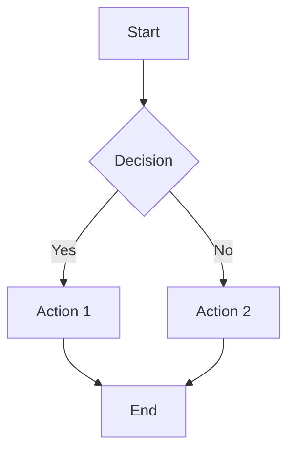
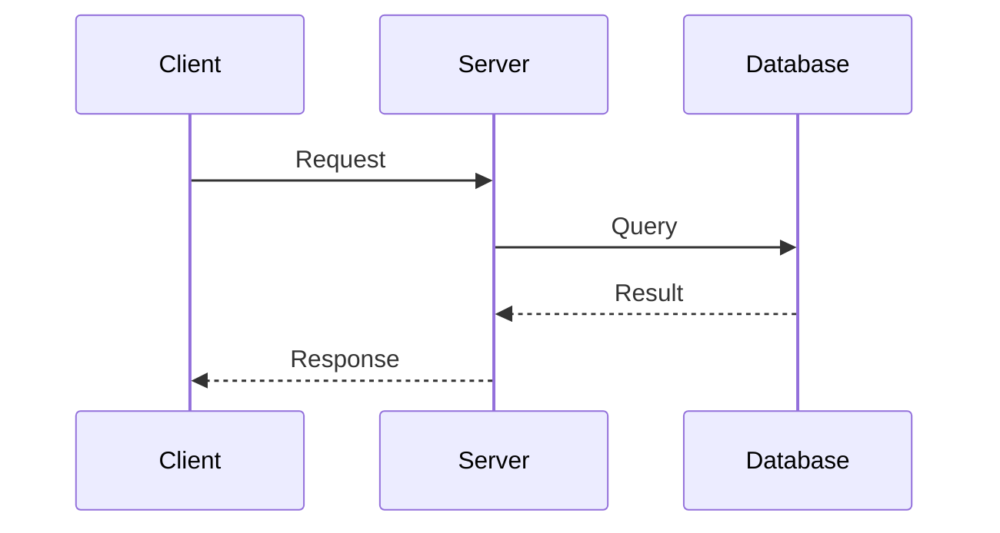
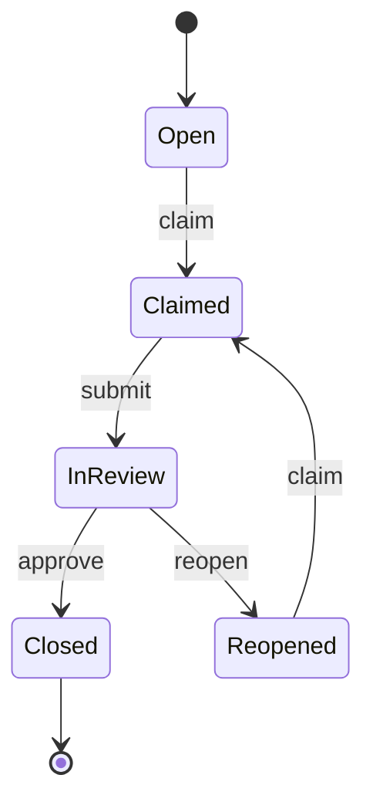
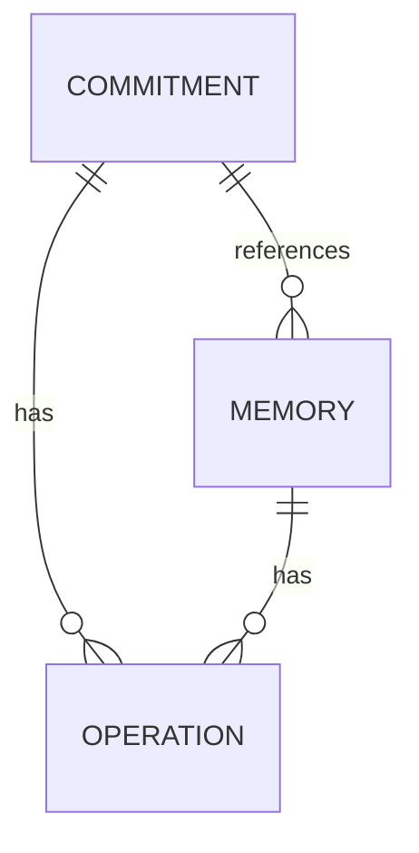
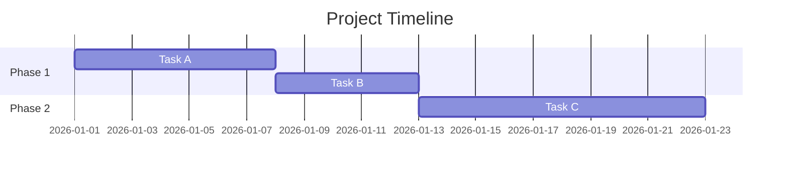

# Publish Skill Reference

Complete reference documentation for the Mentu publication layer.

## Architecture

```
┌─────────────────┐     ┌──────────────────┐     ┌─────────────────┐
│  mentu publish  │────▶│  .mentu/ledger   │────▶│  Pub Server     │
│  (CLI command)  │     │  (append op)     │     │  (reads ledger) │
└─────────────────┘     └──────────────────┘     └─────────────────┘
                                                          │
                                                          ▼
                                                 ┌─────────────────┐
                                                 │  Browser        │
                                                 │  localhost:3456 │
                                                 └─────────────────┘
```

## Ledger Operation Format

Each `publish` operation is appended to the ledger:

```json
{
  "id": "op_abc12345",
  "op": "publish",
  "ts": "2026-01-02T12:00:00.000Z",
  "actor": "rashid.azarang.e@gmail.com",
  "workspace": "mentu-ai",
  "payload": {
    "id": "pub_def67890",
    "module": "docs",
    "path": "architecture/overview",
    "version": 1,
    "url": "mentu.ai/p/mentu-ai/docs/architecture/overview",
    "content": "# Architecture\n\n...",
    "source": {
      "type": "memory",
      "id": "mem_xyz98765"
    }
  }
}
```

## Field Reference

### Required Fields

| Field | Type | Description |
|-------|------|-------------|
| `module` | string | One of: `docs`, `evidence`, `artifacts`, `assets` |
| `path` | string | Publication path, e.g., `feature/overview` |

### Optional Fields

| Field | Type | Description |
|-------|------|-------------|
| `content` | string | Markdown content |
| `source` | string | Source memory or commitment ID |
| `actor` | string | Override actor identity |

## URL Structure

Publications are addressable at:

```
mentu.ai/p/{workspace}/{module}/{path}
```

Example:
```
mentu.ai/p/mentu-ai/docs/architecture/overview
```

Local server equivalent:
```
http://localhost:3456/p/mentu-ai/docs/architecture/overview
```

## Genesis Key Permissions

To allow an actor to publish, add `publish` to their operations:

```yaml
permissions:
  actors:
    "user@example.com":
      role: "owner"
      operations: [capture, commit, claim, release, close, annotate, publish]
    "agent:claude-code":
      role: "agent"
      operations: [capture, commit, claim, release, annotate, submit, publish]
```

## Publication Server

### Starting the Server

```bash
# From mentu-ai directory
node .claude/skills/publish/scripts/pub-server.cjs .mentu/ledger.jsonl &
```

### Server Features

| Feature | Description |
|---------|-------------|
| Live ledger reading | Refreshes content on each request |
| Mermaid rendering | Client-side via mermaid.js CDN |
| Syntax highlighting | Custom token-based highlighter |
| Table rendering | Markdown tables to HTML |
| Responsive design | Mobile-friendly layout |

### Port Configuration

Default port: `3456`

To change, edit the server script:
```javascript
const PORT = 3456;  // Change this
```

### Server Dependencies

- Node.js 16+
- No npm packages required (uses built-in `http` module)

## Mermaid Diagram Reference

### Flowchart



Directions: `TD` (top-down), `LR` (left-right), `BT` (bottom-top), `RL` (right-left)

### Sequence Diagram



### State Diagram



### Entity Relationship



### Gantt Chart



## Versioning

Currently, each publish creates a new publication with `version: 1`. To implement versioning:

1. Query existing publications at same path
2. Increment version number
3. Store version history

Future enhancement tracked in roadmap.

## Integration with CI/CD

### GitHub Actions

```yaml
- name: Publish docs
  run: |
    mentu publish --module docs \
      --path "releases/${{ github.ref_name }}" \
      --content "$(cat CHANGELOG.md)"
```

### Post-deployment

```bash
#!/bin/bash
# After deployment, publish evidence
mentu capture "Deployed to production" --kind evidence
DEPLOY_MEM=$(mentu list memories --kind evidence --json | jq -r '.[0].id')
mentu publish --module evidence \
  --path "deploys/$(date +%Y-%m-%d)" \
  --source $DEPLOY_MEM \
  --content "Deployment successful at $(date)"
```

## Troubleshooting

### Common Errors

| Error | Cause | Solution |
|-------|-------|----------|
| `E_PERMISSION_DENIED` | Actor lacks publish permission | Add `publish` to genesis.key |
| `E_REF_NOT_FOUND` | Source ID doesn't exist | Verify memory/commitment ID |
| `E_INVALID_OP` | Invalid module name | Use: docs, evidence, artifacts, assets |

### Debug Mode

```bash
# Check ledger for publish operations
grep '"op":"publish"' .mentu/ledger.jsonl | jq .

# Count publications by module
grep '"op":"publish"' .mentu/ledger.jsonl | jq -r '.payload.module' | sort | uniq -c
```

## Future Enhancements

- [ ] Cloud publication to Supabase Storage
- [ ] CDN deployment via Cloudflare
- [ ] Version history and diffing
- [ ] Search across publications
- [ ] Auto-generated table of contents
- [ ] Cross-linking between publications
