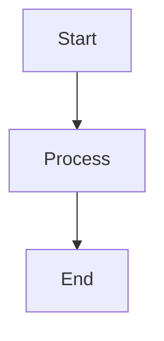
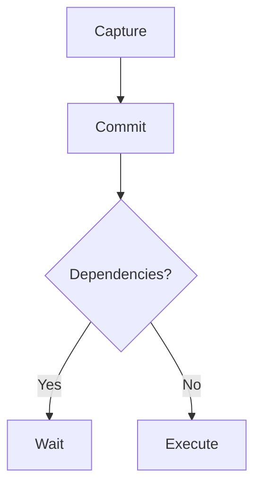
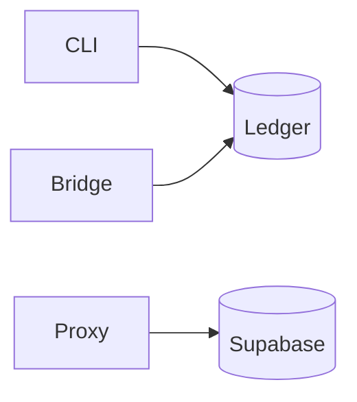

# Mentu Publication Skill

Publish content to the Mentu publication layer with full markdown support including Mermaid diagrams, syntax-highlighted code, and tables.

## Quick Start

```bash
# Publish documentation
mentu publish --module docs --path "feature/overview" --content "# My Doc"

# Publish with Mermaid diagram
mentu publish --module docs --path "architecture/flow" --content '# Architecture


'

# Start local server to view
node .claude/skills/publish/scripts/pub-server.cjs .mentu/ledger.jsonl &
# Open http://localhost:3456
```

## Modules

| Module | Purpose | Example Path |
|--------|---------|--------------|
| `docs` | Documentation, guides, READMEs | `auth/overview`, `api/endpoints` |
| `evidence` | Test results, validation proof | `feature-x/test-results` |
| `artifacts` | Code snippets, configs | `scripts/deploy`, `config/prod` |
| `assets` | Images, binaries, data files | `diagrams/arch`, `data/schema` |

## Content Features

### Mermaid Diagrams

````markdown

````

Supported diagram types:
- `flowchart` / `graph` - Flow diagrams
- `sequenceDiagram` - Sequence diagrams
- `classDiagram` - Class diagrams
- `stateDiagram` - State machines
- `erDiagram` - Entity relationships
- `gantt` - Gantt charts
- `pie` - Pie charts

### Code Blocks

````markdown
```typescript
const cmt = await mentu.commit("Task", {
  source: mem.id,
  meta: { wait_for: "cmt_parent" }
});
```
````

### Tables

```markdown
| Column 1 | Column 2 |
|----------|----------|
| Value A  | Value B  |
```

### Other Markdown

- **Bold**, *italic*, ~~strikethrough~~
- `inline code`
- [Links](url)
- > Blockquotes
- Lists (ordered and unordered)
- Horizontal rules (`---`)

## CLI Reference

```bash
mentu publish [options]

Options:
  -m, --module <module>    Module: docs, evidence, artifacts, assets (required)
  -p, --path <path>        Publication path, e.g., "auth/overview" (required)
  -c, --content <content>  Markdown content to publish
  -s, --source <id>        Link to source memory or commitment
  --actor <id>             Override actor identity
  --json                   Output as JSON
```

## Examples

### Architecture Documentation

```bash
mentu publish --module docs --path "architecture/overview" --content '# System Architecture

## Components



## Data Flow

| Step | Component | Action |
|------|-----------|--------|
| 1 | CLI | Capture memory |
| 2 | CLI | Create commitment |
| 3 | Bridge | Execute remotely |
| 4 | CLI | Close with evidence |
'
```

### Evidence with Source Reference

```bash
# First, find your evidence memory
mentu list memories --kind evidence

# Publish with source link
mentu publish --module evidence \
  --path "feature-x/validation" \
  --source mem_abc123 \
  --content "## Validation Results

All tests passed:
- Unit tests: 47/47
- Integration: 12/12
- E2E: 8/8
"
```

### API Documentation

```bash
mentu publish --module docs --path "api/endpoints" --content '# API Reference

## POST /ops

Execute a Mentu operation.

```typescript
interface OpsRequest {
  op: "capture" | "commit" | "claim" | "close";
  payload: Record<string, unknown>;
  actor?: string;
}
```

### Response

```json
{
  "id": "op_abc123",
  "status": "success"
}
```
'
```

## Local Server

Start the publication server to view content:

```bash
# Start server (runs on port 3456)
node .claude/skills/publish/scripts/pub-server.cjs .mentu/ledger.jsonl &

# View in browser
open http://localhost:3456
```

Features:
- Live reload from ledger
- Mermaid diagram rendering
- Syntax highlighting
- Responsive design
- Module-based navigation

## Workflow Integration

### With Commitments

```bash
# Create commitment for documentation task
mentu commit "Document the auth system" --source mem_task123

# Do the work, then publish
mentu publish --module docs --path "auth/overview" --content "..."

# Capture evidence
EVIDENCE=$(mentu capture "Published auth docs to docs/auth/overview" --kind evidence --json | jq -r '.id')

# Close commitment with evidence
mentu close cmt_xxx --evidence $EVIDENCE
```

### With Evidence Capture

```bash
# Capture test results
TEST_MEM=$(mentu capture "All 47 tests passed" --kind evidence --json | jq -r '.id')

# Publish with link to evidence
mentu publish --module evidence --path "release/v1.0-tests" --source $TEST_MEM --content "..."
```

## Best Practices

1. **Use descriptive paths**: `auth/jwt-flow` not `doc1`
2. **Include diagrams**: Visual documentation is clearer
3. **Link sources**: Connect publications to their evidence
4. **Keep modules organized**: docs for guides, evidence for proof
5. **Version in path**: `api/v2/endpoints` for API versions

## Troubleshooting

**Mermaid not rendering**: Check syntax at [mermaid.live](https://mermaid.live)

**Permission denied**: Ensure actor has `publish` in genesis.key permissions

**Server not starting**: Check port 3456 is available: `lsof -i :3456`

See [REFERENCE.md](REFERENCE.md) for complete configuration options.
