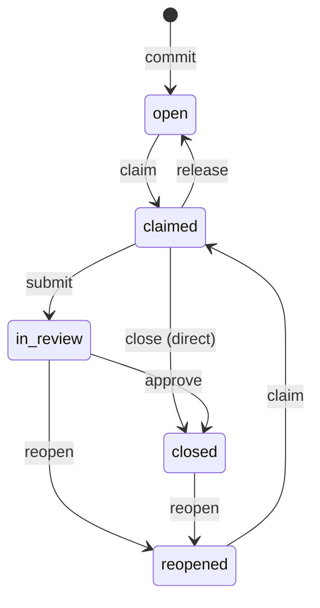
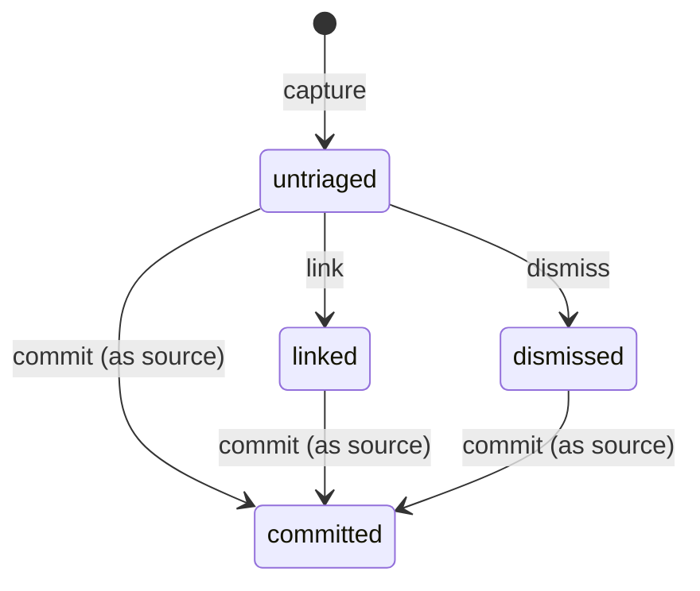

Mentu enforces a strict state machine for both of its core objects. Every transition is triggered by a specific operation and recorded as an immutable entry in the ledger. There are no ad-hoc status changes — only valid operations applied to valid states.

## Commitment States

A commitment has five possible states.

| State | Meaning |
|-------|---------|
| `open` | Created but not yet claimed by anyone. Available for pickup. |
| `claimed` | An actor has taken ownership. Work is in progress. |
| `in_review` | Work submitted for review. Waiting for approval or rejection. |
| `closed` | Completed with evidence. Terminal state (unless reopened). |
| `reopened` | Previously closed, then determined to be incomplete or incorrect. |

### Commitment State Diagram



### Commitment Transitions

Each row describes one valid state transition.

| From | To | Operation | Who Can Do It | Notes |
|------|----|-----------|---------------|-------|
| (none) | `open` | `commit` | Any actor | Requires `source` (memory ID). Creates the commitment. |
| `open` | `claimed` | `claim` | Any actor | Signals ownership. Only one active claim at a time. |
| `claimed` | `open` | `release` | Claimant | Gives up ownership. Commitment returns to the pool. |
| `claimed` | `in_review` | `submit` | Claimant | Sends work for review. Enters the accountability airlock. |
| `claimed` | `closed` | `close` | Claimant | Direct closure with evidence. Bypasses review (Tier 1). |
| `in_review` | `closed` | `approve` | Reviewer | Reviewer accepts the submission. Evidence is sealed. |
| `in_review` | `reopened` | `reopen` | Reviewer | Reviewer rejects the submission. Needs more work. |
| `closed` | `reopened` | `reopen` | Any actor | Determined incomplete after the fact. Rare but valid. |
| `reopened` | `claimed` | `claim` | Any actor | Someone picks it back up to address the issues. |

Invalid transitions are rejected by the API. For example, you cannot `close` a commitment that is in the `open` state — it must be `claimed` first (or go through `in_review`).

## Memory States

A memory has four possible states.

| State | Meaning |
|-------|---------|
| `untriaged` | Freshly captured. No decision has been made about it. |
| `linked` | Associated with an existing commitment as additional context. |
| `committed` | Promoted into a new commitment (via `commit` with this memory as `source`). |
| `dismissed` | Explicitly decided to not act on. Remains in the ledger for the record. |

### Memory State Diagram



### Memory Transitions

| From | To | Operation | Notes |
|------|----|-----------|-------|
| (none) | `untriaged` | `capture` | Creates the memory. |
| `untriaged` | `committed` | `commit` | Memory used as `source` for a new commitment. |
| `untriaged` | `linked` | `link` | Memory attached to an existing commitment as context. |
| `untriaged` | `dismissed` | `dismiss` | Explicitly triaged as "no action needed." |
| `linked` | `committed` | `commit` | A linked memory can still become the source for a new commitment. |
| `dismissed` | `committed` | `commit` | A dismissed memory can be reconsidered. The dismiss and commit are both in the log. |

Note that `committed` is a terminal state for memories — once a memory has been promoted to a commitment, it cannot be further transitioned. The `linked` and `dismissed` states are soft — they can still be promoted to `committed` if circumstances change.

## State Categories

States fall into three categories that help you understand what needs attention.

### Active States

States where work is happening or expected.

- **Commitment:** `open`, `claimed`, `reopened`
- **Memory:** `untriaged`

These are the states you monitor. Open commitments need someone to claim them. Claimed commitments are in progress. Reopened commitments need to be re-claimed. Untriaged memories need a decision.

### Attention States

States that require a decision from a specific actor.

- **Commitment:** `in_review` — a reviewer must approve or reopen
- **Memory:** `untriaged` — someone must commit, link, or dismiss

### Terminal States

States where no further transitions are expected (though reopening is possible).

- **Commitment:** `closed`
- **Memory:** `committed`, `linked`, `dismissed`

## The Accountability Airlock

The `in_review` state is Mentu's mechanism for ensuring that closure is legitimate. It is called the **accountability airlock** because it creates a buffer zone between "I say I'm done" and "the record says I'm done."

The flow through the airlock:

```
claimed → submit → in_review → approve → closed
                             → reopen  → reopened
```

When a claimant submits their work, the commitment enters `in_review`. At this point, the claimant cannot close it themselves. A separate actor (the reviewer) must either:

- **Approve** — accepting the evidence and moving to `closed`
- **Reopen** — rejecting the submission and sending it back for more work

This separation of concerns prevents the person doing the work from also being the person certifying the work. The airlock is especially valuable in agent workflows, where an AI agent does the work and a human (or a different agent) validates the output.

### Direct Close (Bypassing the Airlock)

Not every commitment needs formal review. The `close` operation (as opposed to `submit` + `approve`) allows direct closure from the `claimed` state:

```
claimed → close(evidence[]) → closed
```

This is appropriate for low-risk work, self-evident completions, or contexts where the overhead of formal review is not justified. The evidence requirement still applies — you must provide proof even when bypassing the airlock.

## Tiered Review

Mentu supports three tiers of review, allowing you to match the review overhead to the risk level.

### Tier 1: Auto-Approval

The claimant closes directly. No reviewer involved. Evidence is still required and permanently recorded, but no second actor validates it.

```
mentu_close({
  "commitment": "cmt_abc123",
  "evidence": [
    { "type": "link", "value": "https://github.com/acme/app/pull/42" }
  ]
})
```

Use for: routine work, low-risk changes, automated pipeline steps.

### Tier 2: Async Review

The claimant submits. A reviewer approves or reopens asynchronously — no blocking wait.

```
// Claimant submits
mentu_submit({
  "commitment": "cmt_abc123",
  "evidence": [
    { "type": "link", "value": "https://github.com/acme/app/pull/99" },
    { "type": "text", "value": "Migration tested on staging. Zero downtime." }
  ]
})

// Later, reviewer approves
mentu_approve({
  "commitment": "cmt_abc123"
})
```

Use for: standard development work, changes that benefit from a second pair of eyes.

### Tier 3: Sync Gate

The claimant submits. Work is blocked until a reviewer approves. The `in_review` state acts as a hard gate — nothing downstream proceeds until the reviewer acts.

The API mechanics are the same as Tier 2 (`submit` + `approve`/`reopen`), but the workflow is configured so that downstream operations depend on the commitment being `closed`. This makes the review a blocking gate rather than an async check.

Use for: production deployments, security-sensitive changes, compliance-critical work.

## Operations Reference

All 12 operations and the objects they act on:

| Operation | Target | Effect |
|-----------|--------|--------|
| `capture` | Creates Memory | New memory in `untriaged` state |
| `commit` | Creates Commitment + transitions Memory | New commitment in `open` state, source memory to `committed` |
| `claim` | Commitment | `open` or `reopened` to `claimed` |
| `release` | Commitment | `claimed` to `open` |
| `submit` | Commitment | `claimed` to `in_review` |
| `approve` | Commitment | `in_review` to `closed` |
| `reopen` | Commitment | `in_review` or `closed` to `reopened` |
| `close` | Commitment | `claimed` to `closed` (direct, with evidence) |
| `annotate` | Memory or Commitment | Adds a note. No state change. |
| `link` | Memory | `untriaged` to `linked` (associates with existing commitment) |
| `dismiss` | Memory | `untriaged` to `dismissed` |
| `triage` | Memory | Bulk operation for processing untriaged memories |

Each operation is recorded as an immutable operation envelope in the ledger, with the actor, timestamp, target, and payload preserved forever.
