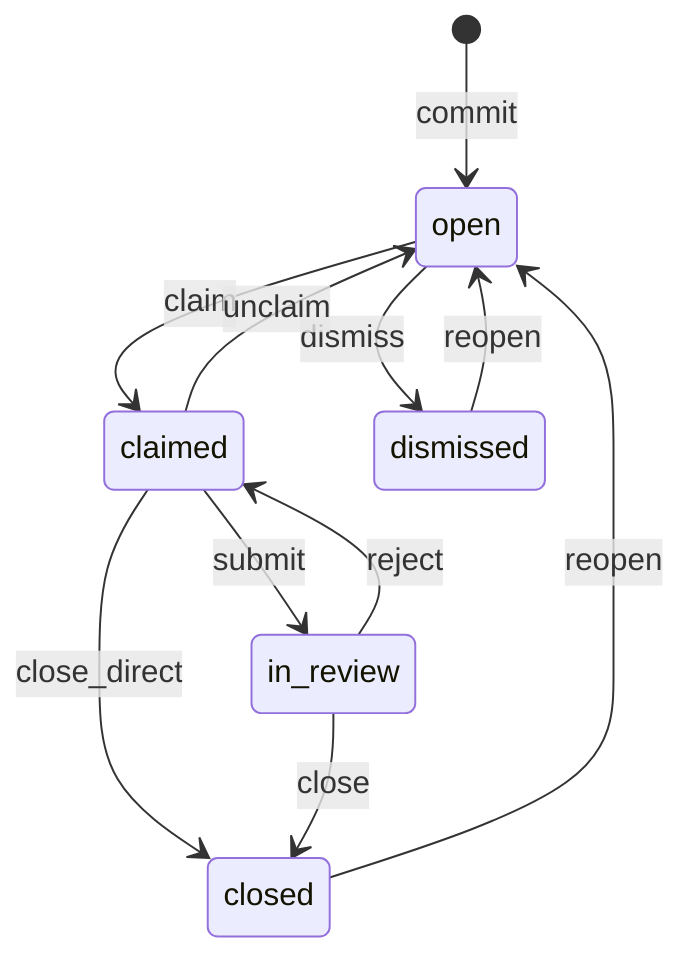
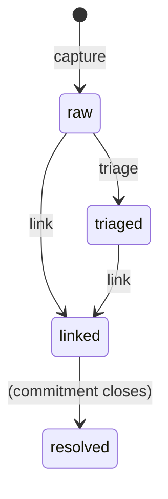

State in Mentu is never stored directly — it is computed by replaying operations from the ledger. This page defines the complete state machines for both commitments and memories, including which operations cause which transitions.

## Commitment States

A commitment exists in exactly one of five states at any point in time:

| State | Category | Description |
|-------|----------|-------------|
| `open` | Attention | Awaiting an actor to claim it |
| `claimed` | Active | An actor is working on it |
| `in_review` | Attention | Submitted, awaiting approval |
| `closed` | Terminal | Completed with a verdict |
| `dismissed` | Terminal | Discarded without completion |

### State Categories

- **Attention states** (`open`, `in_review`) — require someone to take action
- **Active states** (`claimed`) — work is in progress
- **Terminal states** (`closed`, `dismissed`) — lifecycle is complete (but can be reopened)

## Commitment State Machine



### Transition Table

| From | To | Operation | Notes |
|------|----|-----------|-------|
| (none) | `open` | `commit` | Creates the commitment |
| `open` | `claimed` | `claim` | Actor takes ownership |
| `open` | `dismissed` | `dismiss` | Discarded before anyone claims it |
| `claimed` | `open` | `unclaim` | Actor releases the commitment |
| `claimed` | `in_review` | `submit` | Actor submits work for review |
| `claimed` | `closed` | `close` (direct) | Bypass review (v0.1 flow or T1 auto-close) |
| `in_review` | `closed` | `close` | Reviewer approves with verdict |
| `in_review` | `claimed` | `reject` | Reviewer sends back for rework |
| `closed` | `open` | `reopen` | Reopen a previously closed commitment |
| `dismissed` | `open` | `reopen` | Reopen a previously dismissed commitment |

### Non-Transitioning Operations

These operations do not change the commitment's state but are valid while in certain states:

| Operation | Valid In | Effect |
|-----------|----------|--------|
| `evidence` | `claimed` | Attaches evidence to the commitment |
| `link` | Any | Links a memory to the commitment |

## Direct Close vs. Review Flow

The protocol supports two paths to closing a commitment:

### Direct Close (v0.1 Flow)

```
open → claimed → closed
```

The actor claims the commitment and closes it directly, bypassing the review step. This is the original v0.1 flow and is still supported for:

- **Tier 1 (T1) commitments** — trivial changes that auto-close
- **Permissionless workspaces** — no Genesis Key, no review enforcement
- **`close_direct` permission** — actors with explicit authority to bypass review

### Review Flow (v1.0 Flow)

```
open → claimed → in_review → closed
```

The actor claims the commitment, submits it for review, and a reviewer (typically a different actor) approves and closes it. This is the standard flow for governed workspaces.

### The Accountability Airlock

The `in_review` state is the **Accountability Airlock** — the mandatory checkpoint between "work done" and "work accepted." It exists to enforce a separation of concerns:

1. The **doer** (who claims and submits) asserts the work is complete
2. The **reviewer** (who closes) independently verifies the work meets standards

This separation is critical when autonomous agents are doing the work. The Airlock ensures that a human (or a different, authorized actor) validates agent output before it is accepted as done.

Without the Airlock, an agent could claim a commitment, produce incorrect work, and close it — marking it as complete with no oversight. The review flow prevents this.

#### When the Airlock is bypassed

The Airlock can be bypassed in controlled circumstances:

- **T1 auto-close** — the Genesis Key explicitly marks T1 commitments as not requiring review
- **`close_direct` permission** — an authorized actor (typically a senior human) can close without submitting first
- **Permissionless mode** — no Genesis Key means no governance, so direct close is allowed

## Memory States

Memories have a simpler lifecycle than commitments:

| State | Description |
|-------|-------------|
| `raw` | Newly captured, unprocessed |
| `triaged` | Classified with severity/priority |
| `linked` | Associated with a commitment |
| `resolved` | The linked commitment is closed |

### Memory State Machine



### Transition Table

| From | To | Operation | Notes |
|------|----|-----------|-------|
| (none) | `raw` | `capture` | Memory is created |
| `raw` | `triaged` | `triage` | Memory is classified |
| `raw` | `linked` | `link` | Memory is linked to a commitment |
| `triaged` | `linked` | `link` | Triaged memory is linked to a commitment |
| `linked` | `resolved` | (implicit) | When the linked commitment closes, the memory resolves |

### Non-Transitioning Operations

| Operation | Valid In | Effect |
|-----------|----------|--------|
| `annotate` | Any | Adds a note to the memory without changing state |

## Computing State from the Ledger

To compute the current state of a commitment:

```
function computeState(commitmentId, ledger):
    state = null
    for each operation in ledger (ordered by timestamp):
        if operation references commitmentId:
            state = applyTransition(state, operation.op)
    return state
```

The `applyTransition` function follows the transition table above. If an operation would be an invalid transition (e.g., `close` on an `open` commitment), it is rejected at write time and never enters the ledger.

## Terminal State Recovery

Both terminal states (`closed` and `dismissed`) support the `reopen` operation, which transitions the commitment back to `open`. This allows recovery from:

- **Premature closure** — a commitment was closed but the fix was incomplete
- **Incorrect dismissal** — a commitment was dismissed but is actually valid
- **Regression** — a previously fixed issue has reappeared

When a commitment is reopened, its full history (including the previous close/dismiss and reopen) is preserved in the ledger. Nothing is lost.
