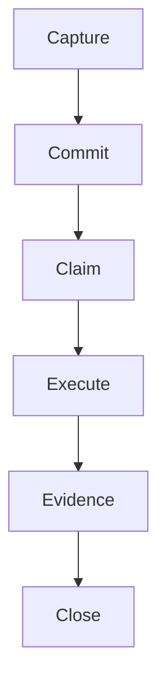

# Mentu Publication Styleguide

Guidelines for publishing documentation, evidence, artifacts, and assets to the Mentu publication layer.

---

## Publication Modules

Publications are organized into four static modules. Each has a specific purpose:

| Module | Color | Purpose | Examples |
|--------|-------|---------|----------|
| **docs** | Blue | Documentation, guides, references | API docs, architecture, tutorials |
| **evidence** | Green | Proof of work, validation results | Test reports, deployment logs, audit trails |
| **artifacts** | Purple | Code, configs, schemas | Scripts, configs, templates, schemas |
| **assets** | Pink | Media, binary files, data | Diagrams, images, data exports |

### When to Use Each Module

#### `docs` - Documentation

Use for persistent, referenceable documentation:

- Architecture overviews
- API references
- How-to guides
- Design decisions
- Protocol specifications

```bash
mentu publish --module docs --path "api/v2/endpoints" --content "..."
```

#### `evidence` - Proof

Use for anything that proves work was done. This is core to Mentu's identity:

- Test results (unit, integration, E2E)
- Deployment confirmations
- Validation reports
- Audit logs
- Security scan results

```bash
mentu publish --module evidence --path "release/v1.2.0/tests" --source mem_xxx --content "..."
```

**Important:** Evidence should always reference a source memory (`--source`).

#### `artifacts` - Technical Assets

Use for technical artifacts that may be referenced or reused:

- Configuration files
- Code snippets
- Database schemas
- Template files
- Build scripts

```bash
mentu publish --module artifacts --path "schemas/user-model" --content "..."
```

#### `assets` - Media & Data

Use for binary or media content:

- Architecture diagrams
- Screenshots
- Data exports
- Logo files

```bash
mentu publish --module assets --path "diagrams/system-flow" --content "..."
```

---

## Path Conventions

Paths should be hierarchical and descriptive.

### Structure

```
{category}/{subcategory}/{item}
```

### Examples

| Path | Description |
|------|-------------|
| `api/v2/auth` | API v2 authentication documentation |
| `architecture/data-flow` | System data flow architecture |
| `release/v1.2.0/changelog` | Release 1.2.0 changelog |
| `feature/auth/design` | Authentication feature design |

### Rules

1. **Use lowercase** with hyphens for spaces
2. **Be descriptive** - `auth/jwt-flow` not `doc1`
3. **Version when needed** - `api/v2/endpoints` for versioned APIs
4. **Group logically** - all auth docs under `auth/`

---

## Content Guidelines

### Markdown Support

Publications support full markdown including:

- Headers (h1-h4)
- **Bold**, *italic*, ~~strikethrough~~
- `inline code`
- Code blocks with syntax highlighting
- Tables
- Lists (ordered and unordered)
- Blockquotes
- Links and images
- Horizontal rules

### Mermaid Diagrams

Use Mermaid for visual documentation:

````markdown

````

Supported diagram types:
- `flowchart` / `graph`
- `sequenceDiagram`
- `stateDiagram`
- `erDiagram`
- `gantt`
- `pie`

### Code Blocks

Always specify the language for syntax highlighting:

````markdown
```typescript
const commitment = await mentu.commit("Task", {
  source: memory.id
});
```
````

### Tables

Use tables for structured data:

```markdown
| Field | Type | Required | Description |
|-------|------|----------|-------------|
| id | string | Yes | Unique identifier |
| body | string | Yes | Content body |
```

---

## Publication Workflow

### Basic Publish

```bash
mentu publish \
  --module docs \
  --path "feature/overview" \
  --content "# Feature Overview\n\n..."
```

### Publish with Source Reference

Link publications to their source memory:

```bash
# First capture evidence
MEM=$(mentu capture "All tests passed" --kind evidence --json | jq -r '.id')

# Then publish with reference
mentu publish \
  --module evidence \
  --path "release/v1.0/tests" \
  --source $MEM \
  --content "## Test Results\n\n..."
```

### Publish from File

```bash
mentu publish \
  --module docs \
  --path "api/endpoints" \
  --content "$(cat docs/API.md)"
```

---

## Integration with Commitments

### Documentation Task Pattern

```bash
# 1. Create commitment for documentation work
mentu commit "Document the auth API" --source mem_task

# 2. Claim and work
mentu claim cmt_xxx

# 3. Publish the documentation
mentu publish --module docs --path "api/auth" --content "..."

# 4. Capture evidence of completion
EVIDENCE=$(mentu capture "Published API docs to docs/api/auth" --kind evidence --json | jq -r '.id')

# 5. Close with evidence
mentu close cmt_xxx --evidence $EVIDENCE
```

### Evidence Pattern

When closing commitments with evidence, publish the evidence:

```bash
# Run tests
npm test > test-results.txt

# Capture as evidence
MEM=$(mentu capture "Test suite passed: 47/47" --kind evidence --json | jq -r '.id')

# Publish for visibility
mentu publish \
  --module evidence \
  --path "feature/auth/tests" \
  --source $MEM \
  --content "$(cat test-results.txt)"

# Close commitment
mentu close cmt_xxx --evidence $MEM
```

---

## Naming Conventions

### File-like Paths

Treat paths like file paths:

| Good | Bad |
|------|-----|
| `auth/jwt-validation` | `JWT_VALIDATION` |
| `api/v2/users` | `APIv2Users` |
| `release/2026-01-03` | `release/Jan3` |

### Versioned Content

For versioned content, include version in path:

```
api/v1/endpoints    # API version 1
api/v2/endpoints    # API version 2
release/v1.0.0/...  # Release specific
```

### Dated Content

For dated content (like releases or evidence):

```
evidence/deploy/2026-01-03
release/v1.2.0/changelog
```

---

## Configuration

### Environment Variables

| Variable | Default | Description |
|----------|---------|-------------|
| `PUB_PORT` | 3456 | Server port |
| `PUB_BASE_PATH` | (empty) | URL base path (e.g., `/docs`) |
| `PUB_SOURCE` | ledger | Data source: `ledger` or `supabase` |
| `MENTU_API_URL` | https://mentu-proxy... | Supabase proxy URL |
| `MENTU_PROXY_TOKEN` | (required) | API authentication token |
| `MENTU_WORKSPACE_ID` | (optional) | Filter by workspace |

### Running the Server

**Local ledger mode:**
```bash
node .claude/skills/publish/scripts/pub-server.cjs .mentu/ledger.jsonl
```

**Supabase mode:**
```bash
PUB_SOURCE=supabase \
MENTU_PROXY_TOKEN=xxx \
node .claude/skills/publish/scripts/pub-server.cjs
```

**With base path (for dashboard integration):**
```bash
PUB_BASE_PATH=/docs \
PUB_SOURCE=supabase \
node .claude/skills/publish/scripts/pub-server.cjs
```

---

## Best Practices

### Do

1. **Link sources** - Always connect publications to source memories
2. **Use diagrams** - Visual documentation is clearer
3. **Keep paths meaningful** - Future readers should understand from path
4. **Version API docs** - `api/v2/` allows parallel versions
5. **Evidence everything** - Publish test results, deployment logs

### Don't

1. **Don't use generic paths** - `doc1`, `test`, `stuff`
2. **Don't forget source links** - Evidence without lineage is weak
3. **Don't mix modules** - Keep docs in docs, evidence in evidence
4. **Don't skip formatting** - Raw text is hard to read

---

## Troubleshooting

| Issue | Cause | Solution |
|-------|-------|----------|
| Mermaid not rendering | Syntax error | Test at mermaid.live |
| Permission denied | Missing permission | Add `publish` to genesis.key |
| Publication not found | Wrong path | Check exact path with module prefix |
| Supabase fetch failing | Auth issue | Verify MENTU_PROXY_TOKEN |

---

## Related Documentation

- [SKILL.md](../.claude/skills/publish/SKILL.md) - Skill reference
- [REFERENCE.md](../.claude/skills/publish/REFERENCE.md) - Complete API reference
- [CLAUDE.md](../CLAUDE.md) - Agent protocol with publishing

---

*Publications are the visible layer of the commitment ledger - proof that work was done.*
